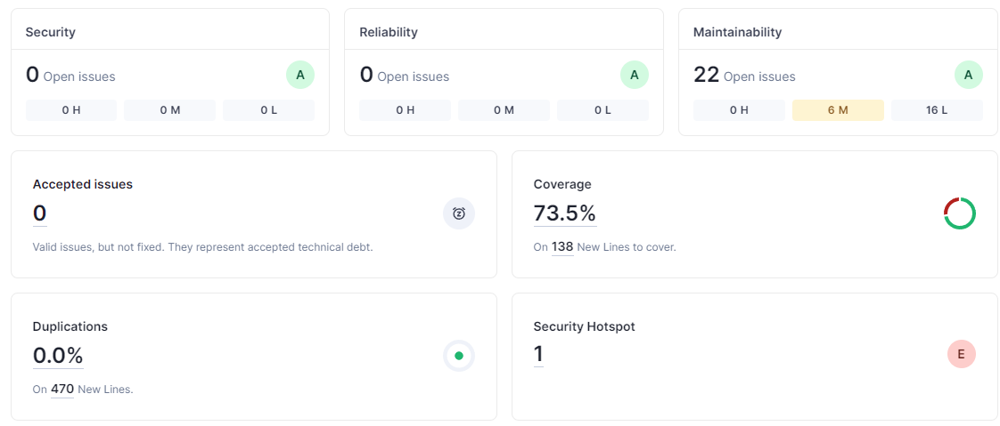
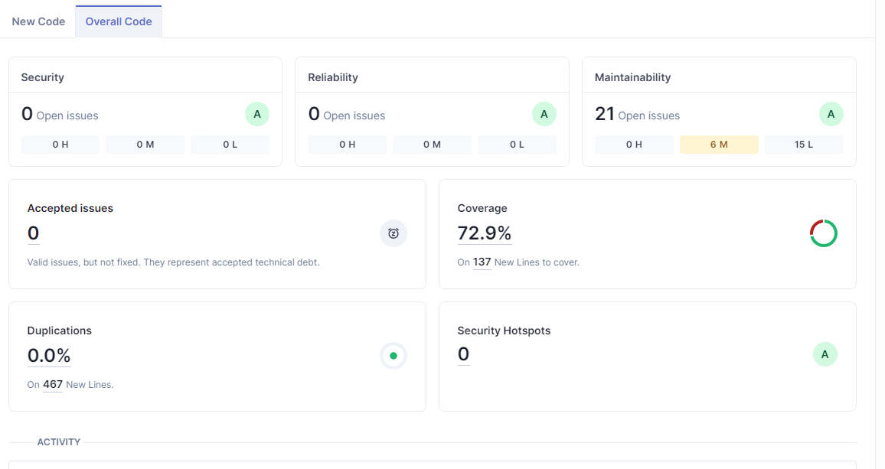

# Lab6_1


## my commands
```bash
sudo service docker start

docker run -d --name sonarqube -e SONAR_ES_BOOTSTRAP_CHECKS_DISABLE=true -p 9000:9000 sonarqube:latest


mvn clean verify sonar:sonar   -Dsonar.projectKey=lab6_1   -Dsonar.projectName='euromillions_sonar'   -Dsonar.host.url=http://localhost:9000   -Dsonar.token=sqp_cb336002f80cecaf6206af33c9dd65544431bc0f

```


## analysis results

| Issue              | Problem Description                      | How to solve                         |
| ------------------ | -----------------------------------------| -------------------------------------|
| Security Hotspots        | Using pseudorandom number generators                                   |   change Random to SecureRandom                            |

Antes:


Depois:

